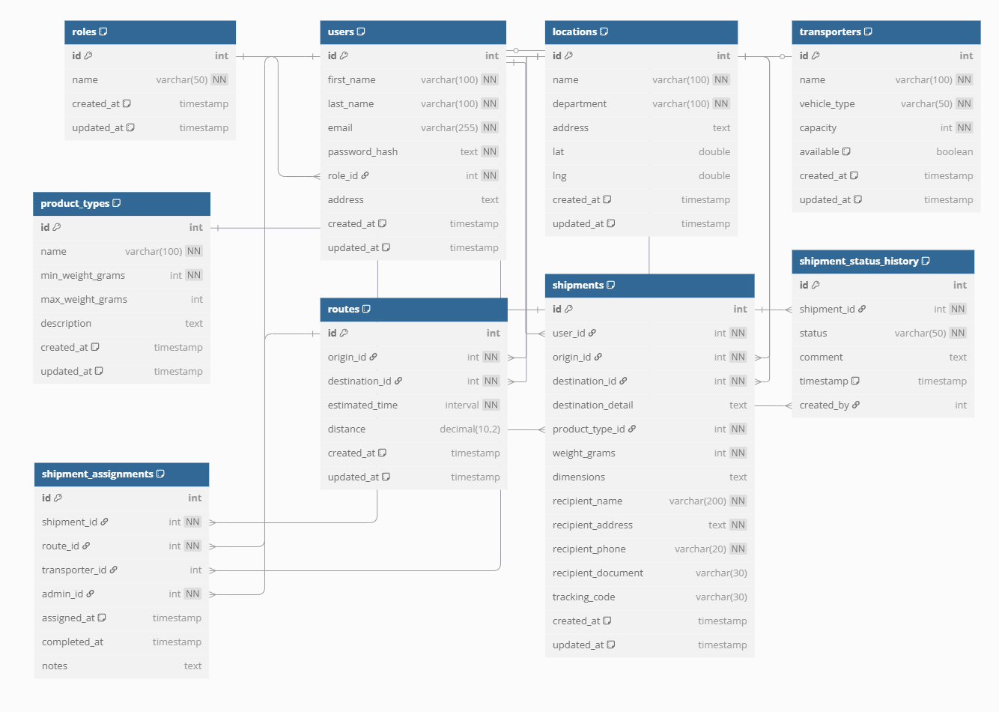

# 📦 Backend Coordinadora - Sistema de Gestión de Envíos - Prueba Técnica


## 📌 Descripción

Backend para el sistema de gestión de envíos de Coordinadora, una empresa de logística que necesita administrar envíos, rutas, transportistas y seguimiento de paquetes. Este sistema ha sido desarrollado siguiendo los principios de Clean Architecture, asegurando un código modular, mantenible y escalable.

El sistema permite gestionar el ciclo completo de un envío:
- Registro de envíos por usuarios
- Asignación de envíos a rutas y transportistas (considerando capacidad disponible)
- Seguimiento del estado de envíos en tiempo real
- Gestión de transportistas y sus capacidades

## 🚀 Tecnologías

- **Node.js** - Entorno de ejecución
- **TypeScript** - Lenguaje con tipado estático para desarrollo más seguro
- **Express** - Framework web para APIs RESTful
- **PostgreSQL** - Base de datos relacional para almacenamiento persistente
- **JWT** - Sistema de autenticación basado en tokens
- **Express Validator** - Validación de datos de entrada en endpoints
- **Redis** - Cache para optimización de rendimiento 
- **Nodemailer** - Servicio de notificaciones por email
- **Clean Architecture** - Patrón de arquitectura de software por capas
- **Swagger/OpenAPI** - Documentación interactiva de API

## 🛠️ Requisitos previos

Antes de comenzar, necesitas tener instalado:

- Node.js >= 14
- PostgreSQL 12+
- **Redis** (necesario para la funcionalidad de caché de estados de envíos)
- Docker (opcional, para ejecutar Redis fácilmente)

## ⚙️ Instalación

```bash
# Clonar el repositorio
git clone https://github.com/tu-usuario/coordinadora-backend.git

# Entrar al directorio
cd coordinadora-backend

# Instalar dependencias
npm install
```

## 📦 Configuración

1. Crea un archivo `.env` basado en `.env.example`:

```bash
cp .env.example .env
```

2. Configura las variables de entorno en el archivo `.env`:

```
PORT=3000
NODE_ENV=development

# PostgreSQL
POSTGRES_HOST=localhost
POSTGRES_PORT=5432
POSTGRES_USER=postgres
POSTGRES_PASSWORD=tu_contraseña
POSTGRES_DB=coordinadora_db

# JWT
JWT_SECRET=tu_clave_secreta_jwt
JWT_EXPIRES_IN=24h

# Email (para notificaciones)
EMAIL_HOST=sandbox.smtp.mailtrap.io
EMAIL_PORT=2525
EMAIL_SECURE=false
EMAIL_USER=bdd20c04fa00fe
EMAIL_PASSWORD=3481620a660b68
EMAIL_FROM=notificaciones@tuempresa.com

# Redis (para cache, opcional)
REDIS_HOST=localhost
REDIS_PORT=6379
```

**Notas importantes:**

1. Para el envio de correos electrónicos se utiliza mailtrap.io y **se dejaron expuestas las variables reales en el archivo .env.example para poder probar la funcionalidad sin mayor problema**.

2. **Después de configurar el archivo .env, es necesario ejecutar el script `npm run db:init` para crear las tablas e insertar los datos iniciales requeridos**. Este paso es fundamental para poder probar todas las funcionalidades del sistema correctamente.
**SE RECOMIENDA LA CREACION DE UNA NUEVA BASE DE DATOS PARA EVITAR PROBLEMAS**

3. **Es necesario tener Redis en ejecución para el correcto funcionamiento del sistema de caché**. Si tienes Docker instalado, puedes iniciar Redis fácilmente con el siguiente comando:

```bash
docker run -d --name redis -p 6379:6379 redis
```

Este comando descarga la imagen oficial de Redis y la ejecuta como un contenedor en el puerto 6379.

4. **Para ejecutar pruebas, se recomienda crear un archivo `.env.test` separado**. Esto permite aislar el entorno de pruebas del entorno de desarrollo:

```
# Configuración para tests (archivo .env.test)
NODE_ENV=test
PORT=3001

# Base de datos separada para tests
POSTGRES_HOST=localhost
POSTGRES_PORT=5432
POSTGRES_USER=postgres
POSTGRES_PASSWORD=tu_contraseña
POSTGRES_DB=coordinadora_test_db

# JWT para tests
JWT_SECRET=clave_secreta_para_tests
JWT_EXPIRES_IN=1h

# No es necesario enviar emails reales en pruebas
EMAIL_HOST=smtp.mailtrap.io
EMAIL_PORT=2525
EMAIL_SECURE=false
EMAIL_USER=test_user
EMAIL_PASSWORD=test_password
EMAIL_FROM=test@example.com

# Redis para tests
REDIS_HOST=localhost
REDIS_PORT=6379
```

La ejecución de pruebas creara registros en la base de datos para su debido funcionamiento.

## 🧪 Scripts disponibles

### Paso previo: Iniciar Redis

**Importante:** Antes de ejecutar la aplicación, es necesario tener Redis en funcionamiento. Si utilizas Docker, puedes iniciarlo con:

```bash
# Iniciar Redis en segundo plano
docker run -d --name redis -p 6379:6379 redis

# Verificar que Redis esté funcionando
docker exec -it redis redis-cli ping

#Esto te devolvera un PONG si esta funcionando correctamente
```

También puedes usar WSL, Redis nativo u otras herramientas similares si lo prefieres.

### Ejecución de la aplicación

```bash
# Ejecutar en modo desarrollo con hot-reload
npm run dev

# Compilar a JavaScript
npm run build

# Ejecutar versión compilada
npm start

# Inicializar base de datos
npm run db:init

# Ejecutar tests
npm test

# Ver cobertura de tests
npm run test:coverage
```

## 🧱 Estructura del proyecto

El proyecto sigue los principios de Clean Architecture, organizando el código en capas conceptuales:

```
src/
  ├── domain/             # Entidades e interfaces del core de negocio
  │   ├── auth/           # Entidades relacionadas con autenticación
  │   ├── entities/       # Modelos de dominio (User, Shipment, Route, etc.)
  │   ├── repositories/   # Interfaces de repositorios
  │   ├── shipments/      # Interfaces específicas para el dominio de envíos
  │   └── notifications/  # Interfaces para notificaciones
  │
  ├── application/        # Casos de uso y servicios de aplicación
  │   ├── auth/           # Casos de uso para autenticación
  │   ├── shipments/      # Casos de uso para envíos y asignaciones
  │   │   ├── factories/  # Fábricas para casos de uso de envíos
  │   │   └── __tests__/  # Tests unitarios para envíos
  │   └── usecases/       # Casos de uso genéricos
  │
  ├── infrastructure/     # Implementaciones concretas
  │   ├── db/             # Conexiones y repositorios de base de datos
  │   │   └── postgres/   # Implementaciones PostgreSQL
  │   │       ├── migrations/ # Migraciones de base de datos
  │   │       └── schema/    # Esquemas SQL y DBML
  │   ├── factories/      # Fábricas para inyección de dependencias
  │   ├── notifications/  # Implementación de servicios de email
  │   ├── redis/          # Implementación de cache con Redis
  │   └── repositories/   # Implementaciones concretas de repositorios
  │
  ├── interfaces/         # Adaptadores e interfaces externas
  │   ├── controllers/    # Controladores de flujo
  │   └── http/           # API HTTP/REST
  │       ├── controllers/  # Controladores de Express
  │       ├── middlewares/  # Middlewares (auth, validación, errores)
  │       ├── routes/       # Definición de rutas
  │       │   └── __tests__/ # Tests de integración
  │       └── validators/   # Esquemas de validación
  │
  ├── shared/             # Utilidades compartidas
  │   ├── dtos/           # Objetos de transferencia de datos
  │   └── helpers/        # Funciones auxiliares
  │
  ├── config/             # Configuración (base de datos, env, etc.)
  ├── app.ts              # Aplicación Express
  └── server.ts           # Punto de entrada

scripts/                  # Scripts de utilidad
  └── init-db.js          # Script para inicialización de base de datos
```

## 🗄️ Base de Datos



### Modelo de Datos

El sistema utiliza PostgreSQL como base de datos relacional con el siguiente modelo:

- `users`: Usuarios del sistema (administradores y clientes)
- `roles`: Roles de usuario (admin, user)
- `locations`: Ciudades y ubicaciones para orígenes y destinos de envíos
- `transporters`: Transportistas disponibles con su capacidad máxima y capacidad disponible
- `product_types`: Categorías de productos (sobre, paquete, paquete pesado) con rangos de peso
- `routes`: Rutas predefinidas entre ubicaciones con tiempos estimados
- `shipments`: Envíos registrados con toda su información
- `shipment_status_history`: Historial de cambios de estado de los envíos
- `shipment_assignments`: Asignaciones de envíos a rutas y transportistas

#### Relaciones clave:

- Un envío pertenece a un usuario y tiene un origen, destino y tipo de producto
- Cada transportista tiene una capacidad total y disponible que se actualiza al asignar envíos
- Los envíos pasan por diferentes estados que se registran en el historial

El esquema completo de la base de datos se puede visualizar usando el archivo DBML en:
`src/infrastructure/db/postgres/schema/model.dbml`

### Inicialización de la Base de Datos

El proyecto incluye scripts para inicializar la base de datos con datos de prueba:

```bash
# Asegúrate de tener configurado el archivo .env
# y que la base de datos ya esté creada en PostgreSQL

# Inicializar base de datos
npm run db:init
```

Este comando ejecuta el script `init.sql` que realiza lo siguiente:
- Crea todas las tablas del modelo
- Establece restricciones y relaciones entre tablas
- Carga datos iniciales:
  - Roles (admin, user)
  - Tipos de producto con rangos de peso
  - 20 ubicaciones principales en Colombia
  - Rutas comunes entre ciudades con tiempos estimados
  - Transportistas de prueba
  - Usuarios de prueba

#### Usuarios preconfigurados para pruebas

El script de inicialización crea los siguientes usuarios para que puedas comenzar a probar la aplicación inmediatamente:

1. **Usuario Administrador**:
   - Email: `admin@coordinadora.com`
   - Contraseña: `admin123`
   - Rol: Administrador (acceso completo al sistema)

2. **Usuario Cliente**:
   - Email: `usuario@ejemplo.com`
   - Contraseña: `user123`
   - Rol: Usuario regular (acceso limitado a sus propios envíos)

## 🧪 Testing

El proyecto cuenta con tests unitarios y de integración para garantizar la calidad del código:

```bash
# Ejecutar todos los tests (utilizará .env.test si existe)
npm test

# Ejecutar tests con cobertura
npm run test:coverage

# Ejecutar tests en modo watch
npm run test:watch

# Inicializar la base de datos de pruebas
NODE_ENV=test npm run db:init
```

**Importante:** Para ejecutar las pruebas correctamente, es recomendable inicializar primero la base de datos de pruebas con el comando `NODE_ENV=test npm run db:init`. Esto asegura que los tests se ejecuten contra un entorno limpio y controlado.

## 🔁 Historias de usuario implementadas

Actualmente, el sistema ha implementado las siguientes historias de usuario:

### HU1: Autenticación de usuarios
- Registro de usuarios nuevos
- Login con email y contraseña 
- Protección de rutas mediante middleware de autenticación
- Roles diferenciados (admin/usuario)

### HU2: Gestión de envíos
- Creación de nuevos envíos
- Consulta de envíos por usuario
- Generación automática de códigos de seguimiento

### HU3: Asignación de envíos a rutas
- Sistema de gestión de capacidad de transportistas
- Asignación de transportistas a envíos
- Actualización de capacidad disponible en tiempo real

### HU4: Seguimiento de estado del envío
- Consulta del estado actual de un envío
- Historial completo de estados
- Actualización de estados (para administradores)

## 🧰 Endpoints principales

El sistema expone una API RESTful documentada con Swagger/OpenAPI. La documentación interactiva está disponible en:

```
http://localhost:3000/api/docs
```

### Endpoints principales:

#### Autenticación
- `POST /api/v1/auth/register` - Registrar nuevo usuario
- `POST /api/v1/auth/login` - Iniciar sesión

#### Envíos
- `POST /api/v1/shipments` - Crear nuevo envío

#### Estados de envío
- `GET /api/v1/shipments/tracking/{trackingCode}/status` - Obtener estado actual del envío por código de seguimiento
- `GET /api/v1/shipments/tracking/{trackingCode}/history` - Obtener historial completo de estados del envío
- `POST /api/v1/shipments/{id}/status` - Actualizar estado del envío (solo administradores)
- `POST /api/v1/shipments/{id}/complete` - Marcar envío como entregado (solo administradores)

#### Asignaciones
- `GET /api/v1/assignments` - Obtener asignaciones de envíos
- `POST /api/v1/assignments` - Asignar envío a una ruta y transportista
- `GET /api/v1/assignments/routes` - Obtener rutas disponibles
- `GET /api/v1/assignments/transporters` - Obtener transportistas disponibles
- `GET /api/v1/assignments/pending-shipments` - Obtener envíos pendientes


## 📄 Licencia

Este proyecto está licenciado bajo la licencia MIT.

### Iván Reyes
https://github.com/Broflotsky


