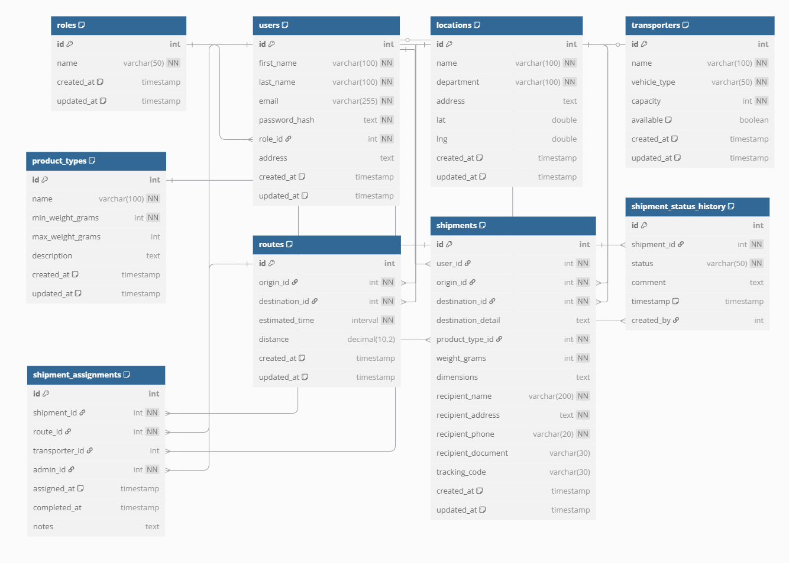

# Backend TypeScript Clean Architecture

Proyecto backend utilizando TypeScript, Express y PostgreSQL, siguiendo los principios de Clean Architecture. Sistema de gestión de envíos para Coordinadora.

## Estructura del Proyecto

```
src/
  ├── domain/             # Entidades y contratos de repositorios
  │   ├── entities/       
  │   └── repositories/   
  │
  ├── application/        # Casos de uso 
  │   └── usecases/       
  │
  ├── infrastructure/     # Implementaciones concretas
  │   ├── db/
  │   │   └── postgres/   # Repositorios para PostgreSQL
  │   │       └── schema/  # Esquemas SQL y DBML
  │   └── redis/          # Implementaciones para Redis
  │
  ├── interfaces/         # Adaptadores de entrada
  │   └── http/
  │       ├── controllers/  # Controladores HTTP
  │       ├── routes/       # Definición de rutas
  │       ├── validators/   # Validaciones con express-validator
  │       └── middlewares/  # Middleware de autenticación, errores, etc.
  │
  ├── shared/             # Código compartido
  │   ├── dtos/           # Objetos de transferencia de datos
  │   └── helpers/        # Utilidades
  │
  ├── config/             # Configuración
  │
  ├── app.ts              # Aplicación Express
  └── server.ts           # Punto de entrada

scripts/                  # Scripts de utilidad
  └── init-db.js          # Script para inicializar la base de datos
```

## Requisitos

- Node.js (v14+)
- PostgreSQL 12+
- Redis (opcional para futuras implementaciones)

## Instalación

```bash
# Instalar dependencias
npm install

# Variables de entorno
cp .env.example .env
# Editar .env con tus configuraciones de PostgreSQL:
# POSTGRES_HOST=localhost
# POSTGRES_PORT=5432
# POSTGRES_USER=postgres
# POSTGRES_PASSWORD=tu_contraseña
# POSTGRES_DB=cleanarchdb

# Ejecutar en desarrollo
npm run dev

# Compilar para producción
npm run build

# Ejecutar en producción
npm start
```

## Base de Datos

### Modelo de Datos

El sistema utiliza PostgreSQL con las siguientes tablas principales:

- `users`: Usuarios del sistema (admin, clientes)
- `roles`: Roles de usuarios
- `locations`: Ciudades y ubicaciones
- `transporters`: Transportistas disponibles
- `product_types`: Categorías de productos (sobre, paquete, paquete pesado)
- `routes`: Rutas entre ubicaciones
- `shipments`: Envíos registrados
- `shipment_status_history`: Historial de estados de envíos
- `shipment_assignments`: Asignaciones de transportistas a envíos

El modelo completo se puede visualizar en la imagen anexada a continuación o utilizando el archivo DBML ubicado en:
`src/infrastructure/db/postgres/schema/model.dbml`

### Inicialización de la Base de Datos

Puedes inicializar la base de datos utilizando el script incluido que creará todas las tablas y cargará datos de prueba:

```bash
# Asegúrate de haber configurado el archivo .env con tus credenciales de PostgreSQL
# y que la base de datos ya esté creada

# Ejecutar script de inicialización
npm run db:init
```

Este comando ejecutará el archivo `init.sql` que contiene:
- Creación de todas las tablas del modelo
- Restricciones y relaciones
- Datos iniciales:
  - Roles (admin, user)
  - Tipos de producto con rangos de peso en gramos
  - Las 20 principales ciudades de Colombia
  - Rutas entre ciudades principales
  - Transportistas de prueba
  - Usuarios de prueba

Alternativamente, puedes ejecutar el script SQL manualmente como se describe en:
`src/infrastructure/db/postgres/schema/README.md`
